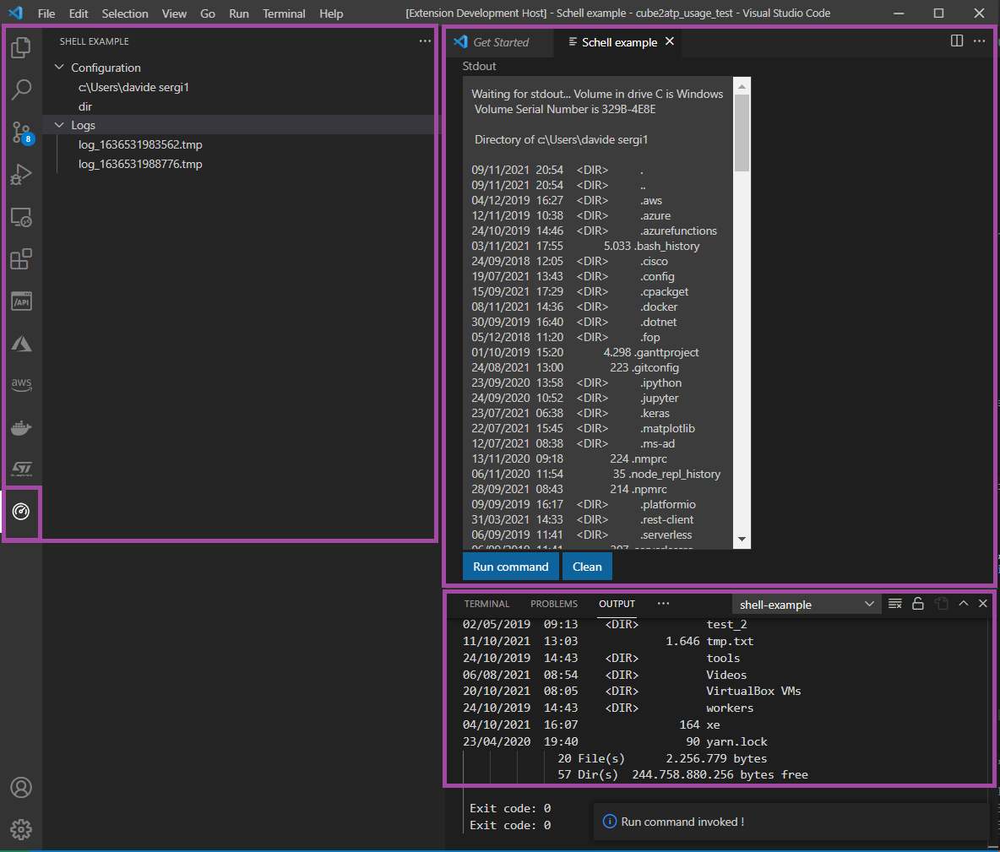

# VSCode extension how-to

Example vscode extension which let executing of shell commands from UI and monitoring of related standard output.

Main concepts:
- Debug extension
- Test suite
- TP SDK
- vscode-webview-toolkit
- Packaging and installation
- VSCode components
  - Tree-view panel
  - Terminal
  - Webview
  - Commands



## Procedure

### 1. Initialize project
Microsoft VSCode documentation explain very well how develop a first vscode extension, link [here](https://code.visualstudio.com/api/get-started/your-first-extension)

In order to scaffold an empty project, follow below steps:

0. *Pre-requisites*: Git, Node.js
1. Install yeaoman CLI and related VSCode plugin
    - Execute: `npm install -g yo generator-code`
2. Scaffold VSCode extension project:
    - Execute `yo code`
    - Enter follow inputs:
        - -> New Extension (Typescript)
        - -> Extension name
        - -> Extension ID (default - get from extension name)
        - -> Extension Description (default - empty)
        - -> Initialize git repository (optional - default No)
        - -> Bundle with webpack (optional - default Babel)
        - -> Package manger (optional - default NPM)

*Notes*: now Typescript project for VSCode extension purpose has been scaffolded 

    -> Debug extension <-

### 2. General configurations
*Tip*: in order to debug an extension, go to Debug side panel and select Run Extension environment. All environments are provided inside `/.vscode/lauch.json`. file.

Steps:
- Install dependencies:
  - TP SDK : `npm install ./cube-atp-sdk-1.0.0.tgz`
  - Codicons icons : `npm install` and  `npm install @vscode/codicons`
- `Package.json` - add following sections:
    - `activationEvents` equal to `*`
    - `contributes.commands`
        ```json
            [
                    {
                        "command": "shell-example.runCommand",
                        "title": "Shell example: Run shell command"
                    },
                    {
                        "command": "shell-example.configureContext",
                        "title": "Shell example: Configure execution context",
                        "icon": "./node_modules/@vscode/codicons/src/icons/edit.svg"
                    }
            ]
        ```

    - `contributes.viewsContainers.activitybar`
         ```json
            [
				{
					"id": "shell-example-view",
					"title": "Shell example",
					"icon": "./node_modules/@vscode/codicons/src/icons/dashboard.svg"
				}
			]
         ```
    - `contributes.viewsWelcome`
        ```json
            [
                {
                    "view": "shell-example-sub-view",
                    "contents": "Shell command activity bar is empty.\n[Configure context](command:shell-example.configureContext)"
                }
		    ]
        ```
    - `contributes.views`
        ```json
			"shell-example-view": [
				{
					"id": "shell-example-sub-view",
					"name": "Shell example",
					"contextualTitle": "Shell example"
				}
			]
        ```
    

*Notes*: use code icons provided by Microsoft ([here](https://microsoft.github.io/vscode-codicons/dist/codicon.html))

    **-> Debug extension <-**

### 3. Command implementation

- Register dummy handler functions for each command
    ```js
        // extension.ts
        import * as vscode from 'vscode';
        import { runCommand, configureContext, Context } from './commands';
        export function activate(context: vscode.ExtensionContext) {
            let disposableRunCommand = vscode.commands.registerCommand('shell-example.runCommand', runCommand);
            let disposableConfigureContext = vscode.commands.registerCommand('shell-example.configureContext', configureContext);
        }

        // commands.ts
        import * as vscode from "vscode";

        export function configureContext(){
            vscode.window.showInformationMessage("Configure context invoked !");
        }

        export function runCommand(){
            vscode.window.showInformationMessage("Run command invoked !");
        }
    ```
    *Notes*:
 
        **-> Debug extension <-**

- Implement real logic for each command
    ```js
        // commands.ts
        import * as vscode from "vscode";

        export class Context {
            static folder: vscode.Uri;
            static cmd: string;
        }

        export async function configureContext(){
            vscode.window.showInformationMessage("Configure context invoked !");

            const folder : vscode.Uri[] | undefined = await vscode.window.showOpenDialog({ canSelectFiles: false, canSelectMany: false });
            const cmd : string | undefined = await vscode.window.showInputBox({placeHolder: "Insert a shell command to execute"});

            if(!(folder?.length && cmd)){
                vscode.window.showErrorMessage("Folder or command are not defined");
                throw new Error("Folder or command are not defined");
            }

            Context.folder = folder[0];
            Context.cmd = cmd;
        }

        export function runCommand(){
            vscode.window.showInformationMessage("Run command invoked !");

            const terminalInstance = vscode.window.createTerminal("shell-example");
            terminalInstance.show();
            terminalInstance.sendText("cd \""+Context.folder.fsPath+"\"");
            terminalInstance.sendText("\""+Context.cmd+"\"");
        }
    ```
    *Notes*:
 
        **-> Debug extension <-**


- Execute shell command with LocalShell class provided by TP SDK in order to access standard output
    ```js
        export function runCommand(){
            vscode.window.showInformationMessage("Run command invoked !");

            // const terminalInstance = vscode.window.createTerminal("shell-example");
            // terminalInstance.show();
            // terminalInstance.sendText("cd \""+Context.folder.fsPath+"\"");
            // terminalInstance.sendText(Context.cmd);

            if(!vscode.workspace.workspaceFolders || vscode.workspace.workspaceFolders.length == 0){
                vscode.window.showErrorMessage("No workspace opened");
                throw new Error("No workspace opened"); 
            }

            const logFile = path.join(vscode.workspace.workspaceFolders[0].uri.fsPath, "log_" + (new Date().getTime())+".tmp")
            const shellInstance = new atp.shell.LocalShell("shell-example", logFile);
            
            shellInstance.stdout((data) => {
                console.log(data)
            });
            shellInstance.exec(Context.cmd, [], undefined, Context.folder);
        }
    ```
    *Notes*:
 
        **-> Debug extension <-**

### 4. Display stuff on panel

- Populate panel with empty content when configure command is invoked
    ```js
        // panel.ts
        import * as atp from "cube-atp-sdk/dist/export";

        export class PanelInstance {
            static panel: atp.ui.panel.Panel | undefined
        }

        export function updatePanel(){
            
            if(!PanelInstance.panel){
                PanelInstance.panel = new atp.ui.panel.Panel("shell-example-sub-view", [], "Empty");
            }
        }

        // commands.ts
        import { updatePanel } from "./panel";

        export async function configureContext(){
            // ...
            updatePanel()
        }
    ```
    *Notes*:
 
        **-> Debug extension <-**

- Code to populate panel with: folder, command and log files information
    ```js
        // commands.ts
        export async function configureContext(){
            // ...
            updatePanel(Context.folder, Context.cmd);
        }

        // panel.ts
        export function updatePanel(folder: vscode.Uri | undefined = undefined, cmd: string | undefined = undefined, logs: string[] | undefined = undefined){
            
            // if(!PanelInstance.panel){
            //     PanelInstance.panel = new atp.ui.panel.Panel("shell-example-sub-view", [], "Empty");
            // }

            let nodes : atp.ui.panel.Node[] = [];
            let configChildren = [];
            if(folder){
                configChildren.push(new Node(folder.fsPath, undefined, undefined, undefined, "folder", undefined));
            }
            if(cmd){
                configChildren.push(new Node(cmd, undefined, undefined, undefined, "cmd", undefined));
            }
            nodes.push(new Node("Configuration", undefined, undefined, configChildren, "logs", undefined));


            if(logs){
                let logNodes = logs.map( l => new Node(l, undefined, undefined, undefined, "log", l))
                nodes.push(new Node("Logs", undefined, undefined, logNodes, "logs", undefined));
            }

            PanelInstance.panel = new atp.ui.panel.Panel("shell-example-sub-view", nodes, "Empty");
        }
    ```
    *Notes*:
 
        **-> Debug extension <-**
- Filesystem watcher to add/remove log files to/from panel in real-time
    ```js
        // extension.ts

        export function activate(){
            // ...
            const folder = vscode.workspace.workspaceFolders?.[0];
            if (folder) {
                const ptn = new vscode.RelativePattern(folder, '*.tmp');

                watcher = vscode.workspace.createFileSystemWatcher(ptn, false, true, false);
                watcher.onDidCreate(async uri => { 
                    logFiles.push(path.basename(uri.fsPath));
                    updatePanel(Context.folder, Context.cmd, logFiles);
                });
                watcher.onDidDelete(async uri => { 
                    logFiles = logFiles.filter( lf => lf !== path.basename(uri.fsPath));
                    updatePanel(Context.folder, Context.cmd, logFiles);
                });
            }
        }
    ```
    *Notes*:
 
        **-> Debug extension <-**
### 5. Display stuff webview

- Give a look to html app example  `./webview/index.html`: send `run_command` message and receive related standard output (exploited `vscode-webview-toolkit` Microsoft library)

- Update `package.json`:
  - `contributes.commands`
    ```json
        {
            "command": "shell-example.openWebview",
            "title": "Shell example: Open webapp view"
        }
    ```
  - `contributes.commands.menus.view/title`
    ```json
    	{
            "command": "shell-example.openWebview",
            "when": "view == shell-example-sub-view"
        }
    ```

- Add command to open webview

    ```js
        // extension.ts
        export let contextExt: vscode.ExtensionContext;
        export function activate(context: vscode.ExtensionContext) {
            contextExt = context;
            // ...
        }

        //webview.ts
        import * as vscode from "vscode";
        import * as atp from "cube-atp-sdk/dist/export";

        import { contextExt } from "./extension";
        import * as fs from "fs";
        import { shellInstance } from "./commands";
        const path = require("path");

        export function openWebview(){
            const appFolder = path.join(contextExt.extensionUri.fsPath, "webview");
            const htmlPage = path.join(appFolder, "index.html");
            
            const htmlPageContent = fs.readFileSync(htmlPage);

            const app = new atp.ui.editor.EditorWebApp(vscode.Uri.file(appFolder), htmlPageContent.toString(), "shell-example", "Schell example");
            app.onMessage( async (message) => {
                if(message.type === "run_command"){
                    await vscode.commands.executeCommand("shell-example.runCommand");
                    shellInstance.stdout( e => app.sendMessage(new atp.ui.editor.models.EditorMessage("stdout", undefined, e.toString())));
                } else {
                    vscode.window.showErrorMessage("Message type unknown !");
                }
            }); 
        }
    ```

    *Notes*:
 
        **-> Debug extension <-**

## Test extension
By default, when a VSCode extension is scaffolded, a Mocha based test suite is automatically added: `/src/test/`.

To run test, select `Extensions test` environment from debug panel.

### Configure command test
```js
    // /src/test/suite/extension.test.ts
    suite('Extension Test Suite', () => {
        // ...
        test('Configure command test', async () => {
            await vscode.commands.executeCommand("shell-example.configureContext");
        }).timeout(10000);   
    })
```

## Publish/Package extension
In order to package and/or publish a vscode extension it is need an additional tool: `vsce`
- Install it with NPM: `npm install -g vsce`
- For packaging, run inside vscode extension project folder: `vsce package`